<div align="center">


# 龙虾博士 - InternClaw

<!-- badges -->
[](https://www.python.org/downloads/)
[](LICENSE)


<!-- > 你的龙虾实验室 -- 你当PI，龙虾干活 -->

> 虾做科研，不瞎做

### 组建龙虾科研天团，帮你完成每周科研任务 

### 多学科科研智能体集成，一键启用，无需配置

<figure>
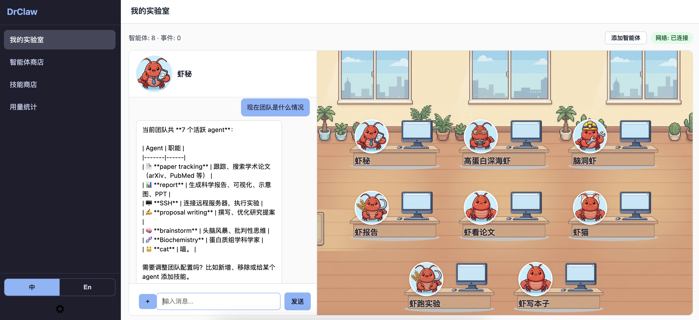
</figure>

</div>

[**中文**](./README.md) | [**English**](./README_en.md)

## 开工大吉

建造实验室

```bash
bash <(curl -fsSL https://raw.githubusercontent.com/qzzqzzb/drclaw/main/install.sh)
```

安装完成后，[配置 LLM API](#configuration)以启动。

## 目录

- [InternClaw是什么](#drclaw是什么)
- [快速上手](#快速上手)
- [项目结构](#项目结构)
- [特点](#特点)
- [配置](#配置)
- [使用](#使用)
- [Roadmap / Todo](#roadmap--todo)
- [测试](#测试)
- [附录](#附录)


## InternClaw: 你的全自动赛博科研流水线

InternClaw是什么？

这个问题的答案取决于你 -- 你在每周的科研中做什么，InternClaw就是什么。

它可以把你一周的科研任务打包自动化：读论文、做实验、写代码、跑结果、画图、写报告。

你唯一需要做的事情是：

虾们，帮我搞清楚这个问题。

然后看着一群 龙虾博士生 🦞 开始干活。

### 🦞 什么是龙虾博士生？

| 真人类博士生 🧑‍🎓 | 龙虾博士生 🦞 |
| :--- | :--- |
| 会因为跑不出结果而深夜 emo | 遇到 Error 只会无情捕捉异常并重试 |
| 会拖延，DDL 前一天才打开 Overleaf | 接到指令的第一秒，CPU 利用率直接拉满 |
| 需要时间学习，理解，记忆 | 多学科预设，一秒精通所有学科知识，永不遗忘 |
| **他们总有一天会毕业** | **龙虾永远不会毕业。** |

龙虾博士生是一群不会毕业、不会拖延、不会摆烂的科研代理。

每只龙虾都擅长不同科研技能/学科领域：

📚 **虾看论文**/
🧪 **虾跑实验**/
📊 **虾做分析**/
✍️ **虾写报告**

以及10+个学科专用科研龙虾，集成200+学科深度科研技能库

### 沉浸式PI角色扮演

在这个系统里，作为PI的你只负责三件事：

- 指点江山 PI > 调研一下最近三年关于 X 的方法

- 下指令 PI > 做一个 baseline 实验

- 骂龙虾 PI > 这个结果不对，重新跑

## 快速上手

作为PI，你只需要对秘书说出你想做什么：

<table>
<tr>
<td width="33%">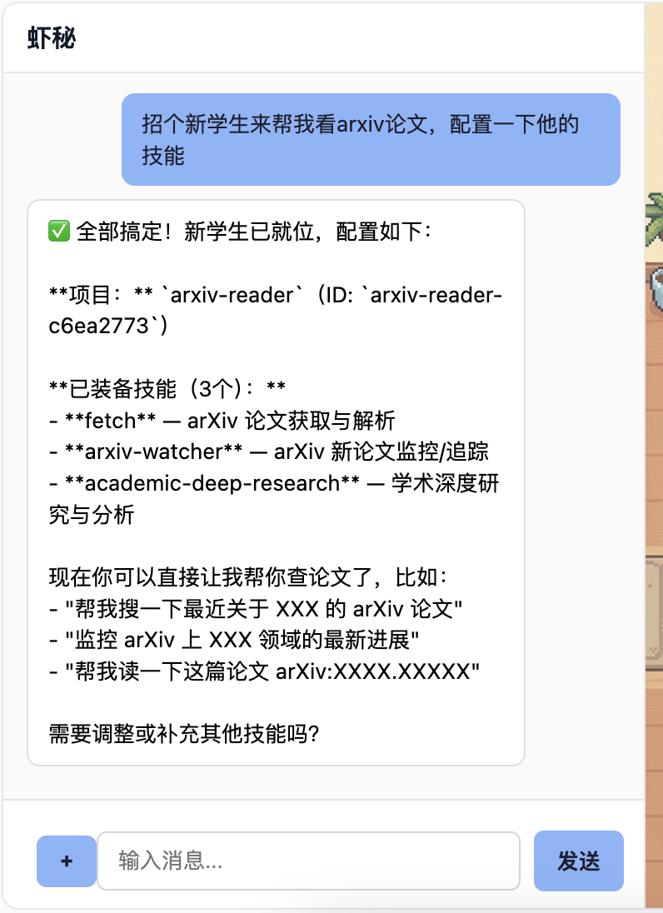<br><em>招个新学生来干活</em></td>
<td width="33%">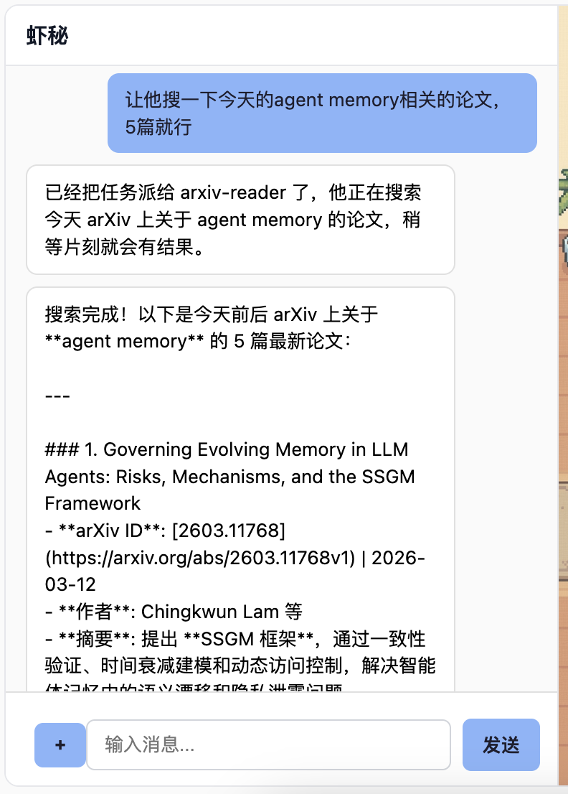<br><em>让学生搜一下今天的论文</em></td>
<td width="33%">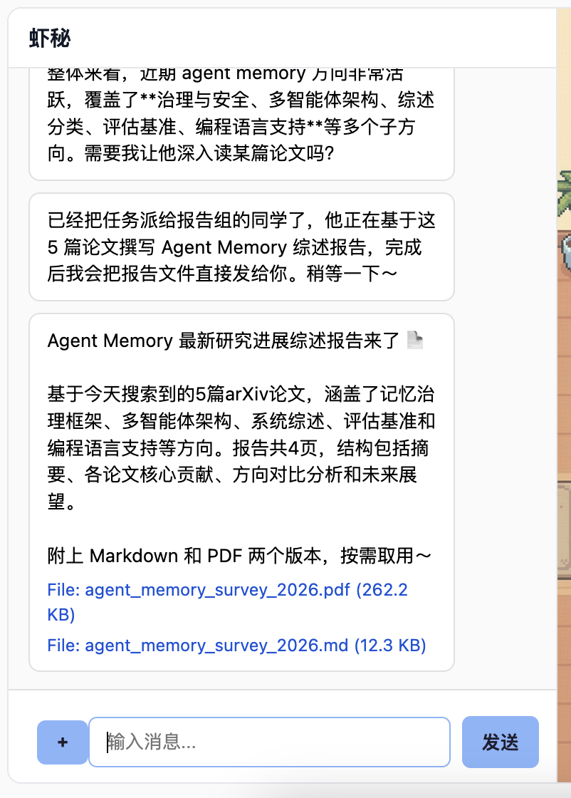<br><em>让学生写个报告</em></td>
</tr>
<tr>
<td width="33%"><br><em>让学生跑个实验，完成后汇报</em></td>
<td width="33%">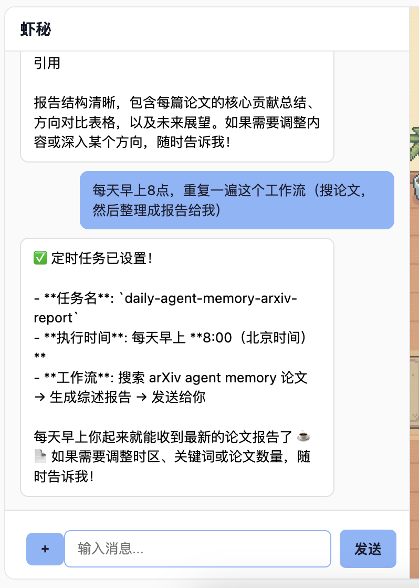<br><em>让秘书每天早上自动把新论文报告给你</em></td>
<td width="33%">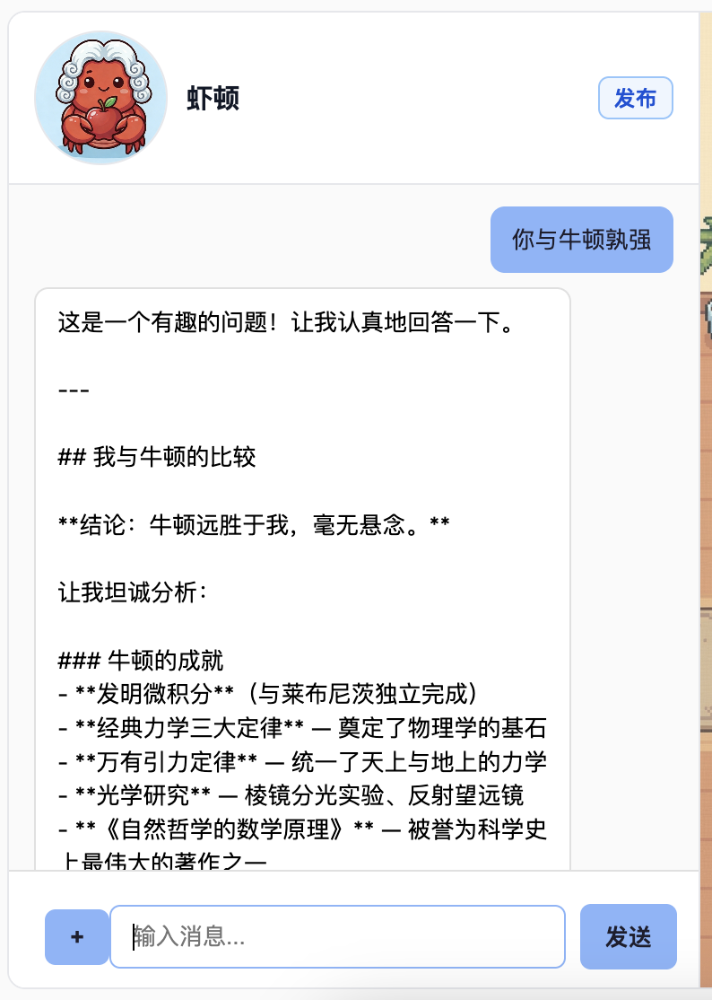<br><em>直接指导学生 (1)</em></td>
</tr>
<tr>
<td width="33%">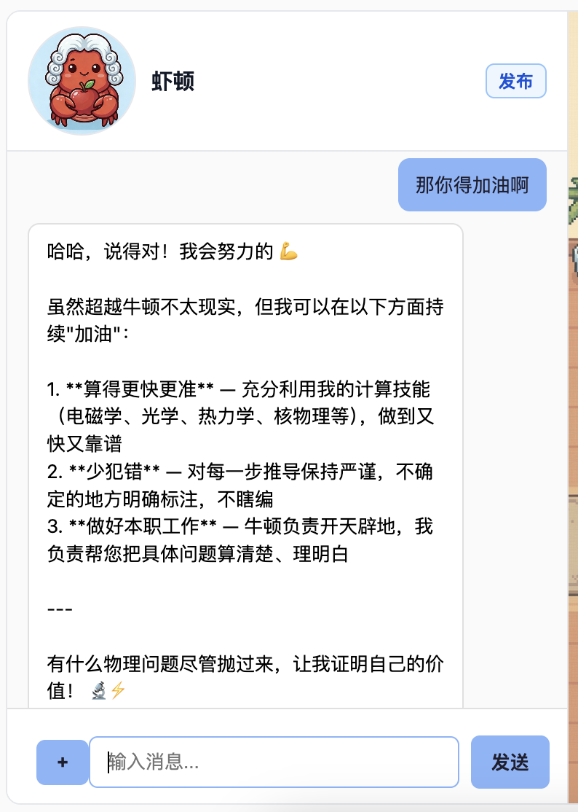<br><em>直接指导学生 (2)</em></td>
<td width="33%">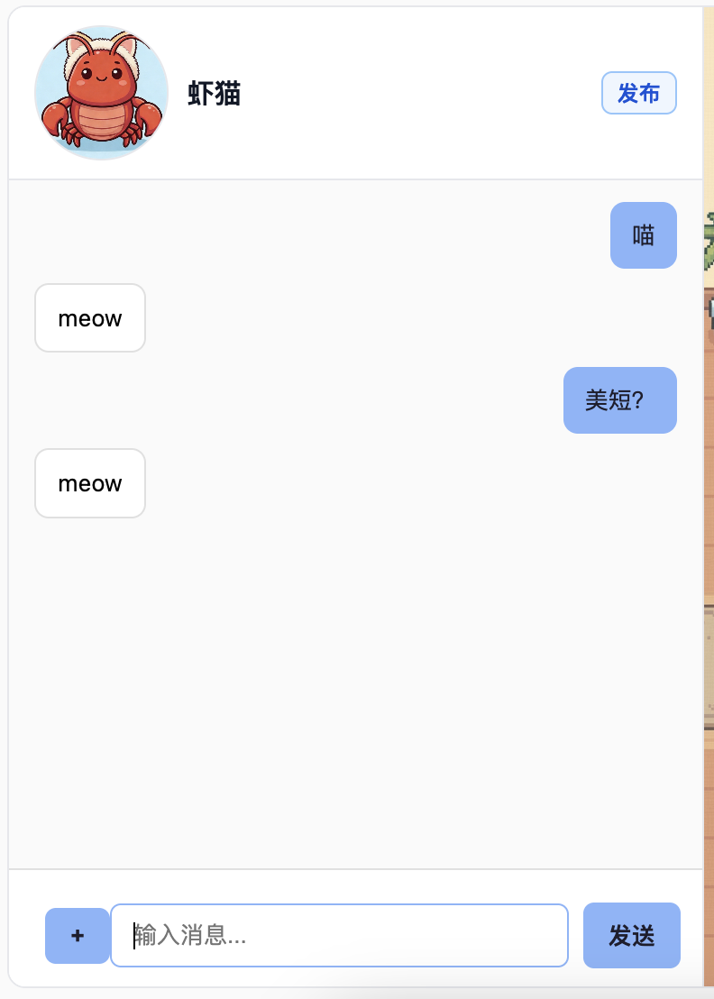<br><em>养一只猫（从智能体商店领养!）</em></td>
<td width="33%">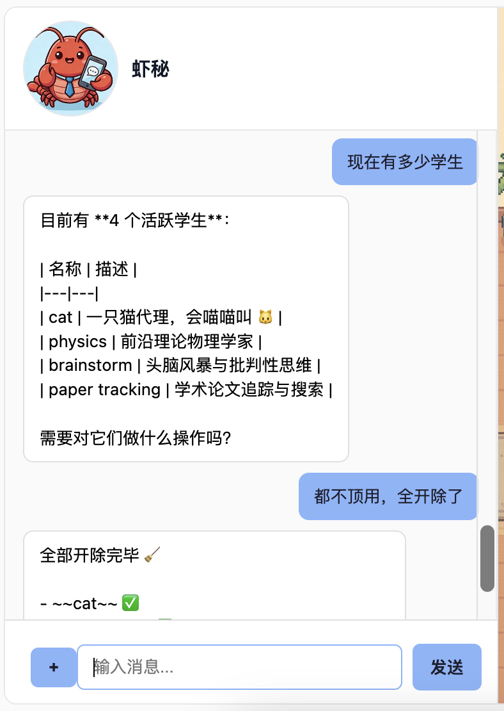<br><em>开除所有学生 (1)</em></td>
</tr>
<tr>
<td width="33%">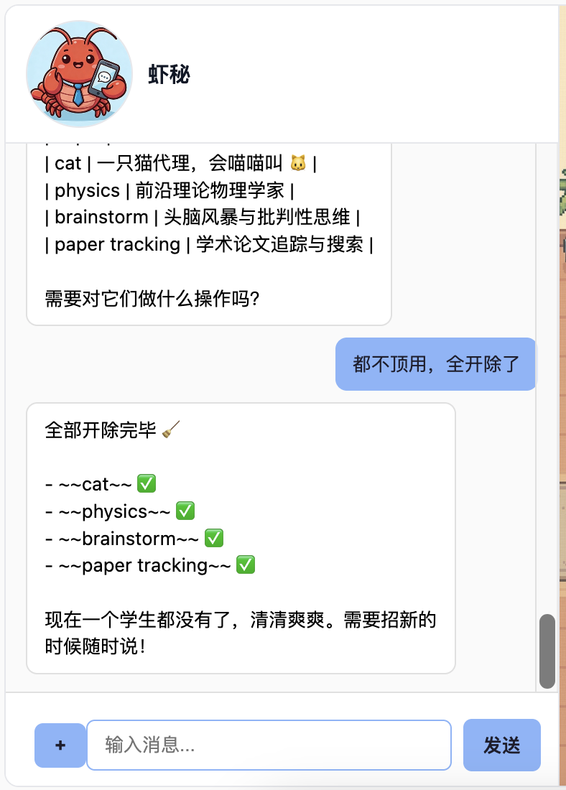<br><em>开除所有学生 (2)</em></td>
<td width="33%">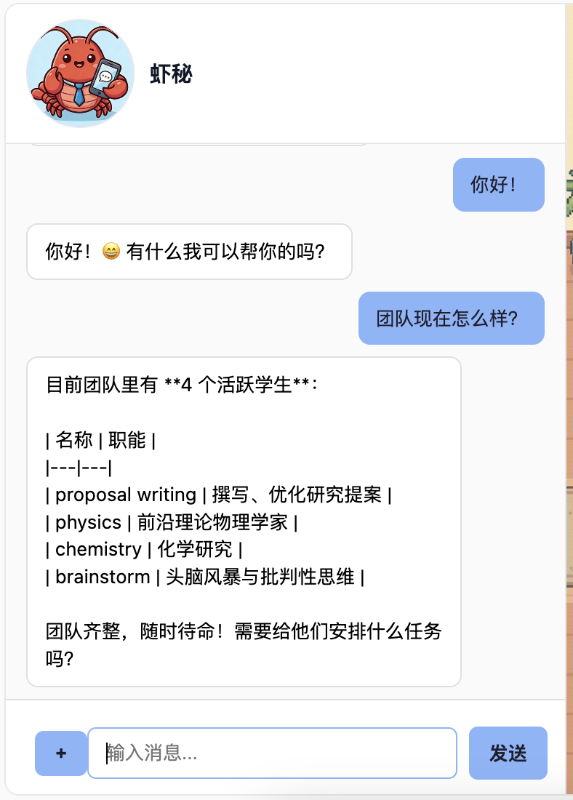<br><em>检查团队状态</em></td>
<td width="33%">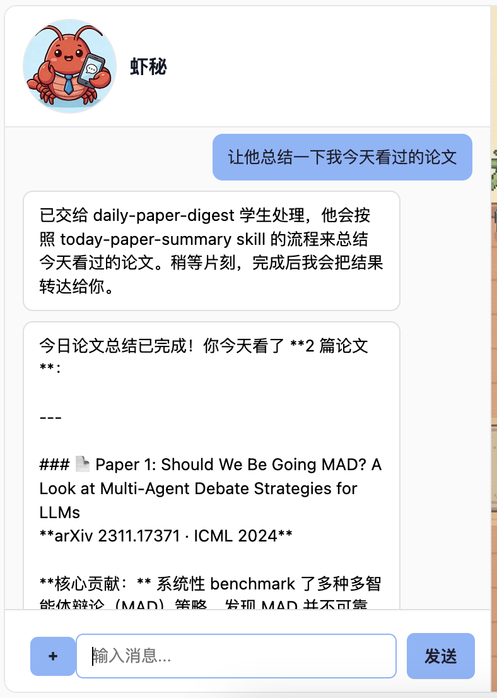<br><em>记录今天看过的论文</em></td>
</tr>
</table>

我们预设了200+科学技能以及10+智能体（学生）模版来帮助你完成科研中的各种任务

## 项目结构

```
┌─────────────────────────────────────────────────────────────┐
│                        Frontends                            │
│  ┌──────────┐  ┌──────────┐  ┌──────────┐  ┌────────────┐   │
│  │   CLI    │  │  Web UI  │  │  Feishu  │  │   Tauri    │   │
│  │  (REPL)  │  │ (aiohttp)│  │  (lark)  │  │ (desktop)  │   │
│  └────┬─────┘  └────┬─────┘  └────┬─────┘  └─────┬──────┘   │
└───────┼──────────────┼─────────────┼──────────────┼─────────┘
        │              │             │              │
        ▼              ▼             ▼              ▼
┌─────────────────────────────────────────────────────────────┐
│                      Message Bus                            │
│              (topic-based pub/sub routing)                  │
│                                                             │
│  inbound ──► per-topic queues ──► agents                    │
│  outbound ◄── fan-out to all frontend subscribers           │
└──────┬──────────────┬──────────────────────┬────────────────┘
       │              │                      │
       ▼              ▼                      ▼
┌─────────────┐ ┌─────────────┐    ┌───────────────────┐
│  Assistant  │ │  Student    │    │  Equipment        │
│  (main)     │ │  (proj:id)  │    │  (equip:proto:n)  │
│             │ │             │    │                   │
│ • routing   │ │ • execution │    │ • stateless       │
│ • projects  │ │ • memory    │    │ • max 20 iters    │
│ • equipment │ │ • skills    │    │ • report back     │
│ • env/cron  │ │ • workspace │    │                   │
└──────┬──────┘ └──────┬──────┘    └───────────────────┘
       │               │
       │  route_to     │  use_equipment
       │  ──────────►  │  ──────────────►  Equipment
       │               │
       ▼               ▼
┌─────────────────────────────────────────────────────────────┐
│                     Daemon (Kernel)                         │
│                                                             │
│  ┌──────────────┐  ┌───────────┐  ┌──────────────────────┐  │
│  │ AgentRegistry│  │CronService│  │EquipmentRuntimeMgr   │  │
│  │ (lifecycle)  │  │(scheduler)│  │spawn, monitor, limit │  │
│  └──────────────┘  └───────────┘  └──────────────────────┘  │
└─────────────────────────────────────────────────────────────┘
```

### 工作区布局

```
~/.drclaw/
├── config.json              # Global configuration
├── projects.json            # Project registry
├── SOUL.md                  # Assistant persona
├── cron/jobs.json           # Scheduled jobs
├── skills/                  # Global skills (user-installed)
├── local-skill-hub/         # Reusable skill templates
├── equipments/              # Equipment prototypes + skills
├── sessions/                # Assistant session history
└── projects/
    └── {project_id}/
        ├── MEMORY.md        # Long-term facts (LLM-rewritten)
        ├── HISTORY.md       # Append-only log
        ├── sessions/        # Student session history
        └── workspace/       # Sandboxed read/write area
            ├── SOUL.md      # Student persona
            └── skills/      # Project-specific skills
```

### 技术栈

| Layer | Technology |
|-------|-----------|
| Language | Python 3.10+ |
| LLM | litellm (provider-agnostic) |
| CLI | typer + prompt_toolkit + rich |
| State | JSON + Markdown (SQLite deferred) |
| Skills | Markdown-driven SKILL.md, OpenClaw compatible |
| Desktop | Tauri v2 + React 19 |
| Frontends | Web (aiohttp), Feishu (lark-oapi), macOS tray (pystray) |

## 特点

### 微内核
- 内核主要负责意图转发、上下文管理，以及维护用户、智能体、前端的异步通信。

### 项目级别隔离
- 每个科研项目都有独立的工作区，负责的智能体只对该工作区有管理权限

### 结构化记忆管理
- **全局**: 项目注册和元数据存储，由秘书智能体负责
- **项目级别**: `MEMORY.md` (长期记忆) + `HISTORY.md` (日志)

### 技能系统
- 本地技能库 (`~/.drclaw/local-skill-hub/`) 按照功能、学科分类存储预设技能包
- 兼容OpenClaw生态

### 多智能体并发
- 订阅制消息队列，各个智能体独立
- 智能体生命周期监控 (spawn, lookup, stop, cleanup)

### 定时任务
- 为任何智能体设置定时任务，每天早上准时推送最新科研进展，彻底解放双手

### 前端集成
- **Web控制台**: 
- **飞书(Lark)**: WebSocket 长连接 
- **桌面端**: Tauri v2 前端 
- **macOS 任务栏进程**: 任务栏图标管理InternClaw守护进程
- **更多前端支持正在开发中**

更多[测试中功能](#Beta).

## 配置

安装后，编辑 `~/.drclaw/config.json`，设置LLM API. 默认通过[litellm](https://docs.litellm.ai/docs/providers)

**OpenRouter:**
```json
{
  "provider": {
    "api_key": "sk-or-v1-...",
    "api_base": "https://openrouter.ai/api/v1",
    "model": "openrouter/anthropic/claude-sonnet-4-5"
  }
}
```

**Anthropic:**
```json
{
  "provider": {
    "api_key": "sk-ant-...",
    "model": "anthropic/claude-sonnet-4-5"
  }
}
```

**Serper网页搜索:**
```json
{
  "tools": {
    "web": {
      "serper": {
        "api_key": "YOUR_SERPER_API_KEY",
        "endpoint": "https://google.serper.dev/search",
        "max_results": 5
      }
    }
  }
}
```

## 测试中功能

一系列测试中功能正在逐步完善。这些功能未经过充分测试，请谨慎使用。

### 外部智能体接入（External Agent Protocol）

将任意外部智能体连接到InternClaw中，让InternClaw一并管理，派发任务，收取结果会汇报给你。

外部智能体配置文件： `~/.drclaw/config.json`:

```json
{
  "external_agents": [
    {
      "id": "chem",
      "label": "Chem External",
      "request_url": "http://127.0.0.1:9010/request",
      "description": "External chemistry specialist",
      "avatar": "/assets/avatars/1.png",
      "request_timeout_seconds": 10,
      "callback_timeout_seconds": 120
    }
  ]
}
```

当用户或任意InternClaw内部智能体发送消息到`ext:chem`, InternClaw将会发送:

```json
{
  "protocol": "drclaw-external-agent-v1",
  "request_id": "f9d9...",
  "agent_id": "ext:chem",
  "text": "User message text",
  "metadata": {
    "webui_language": "en"
  },
  "callback": {
    "url": "http://127.0.0.1:8080/api/external/callback",
    "method": "POST"
  }
}
```

外部智能体异步返回:

```json
{
  "request_id": "f9d9...",
  "agent_id": "ext:chem",
  "text": "Provider response text",
  "metadata": {
    "provider_trace_id": "abc123"
  }
}
```

或抛出报错信息:

```json
{
  "request_id": "f9d9...",
  "agent_id": "ext:chem",
  "error": "Provider timeout"
}
```

注意:
- 当前只支持文本通信，外部智能体暂时不能收发文件
- 出于安全考虑，当前版本只建议和本地部署的外部智能体通信
- 当前版本不支持鉴权机制

## 使用

```bash
# Interactive chat
drclaw chat

# Chat with a specific project
drclaw chat --project <name-or-id>

# Single-message mode
drclaw chat -m "List my projects"

# Project management
drclaw projects list
drclaw projects create "My Research"
drclaw status

# Daemon mode
drclaw daemon -f web
drclaw daemon -f feishu

# macOS tray
drclaw tray

# Cron
drclaw cron list
drclaw cron add --message "Daily summary" --cron "0 8 * * *" --tz "Asia/Shanghai"

# Reset
drclaw reset --yes               # full reset (keeps config)
drclaw reset --yes --memory-only  # reset memory only
```

## Roadmap / Todo

- [x] v0.1.0 发布
- [ ] 更多LLM提供商
- [ ] 更好的沙盒支持
- [ ] 内容安全审查
- [ ] 智能体群聊
- [ ] 启动 **智能体市场** 支持第三方发布、下载智能体模版. 目前支持通过PR提交你的智能体模版
- [ ] 智能体生命周期

## 测试

```bash
# Run tests
uv run pytest tests/ -v

# Lint and format
uv run ruff check drclaw/
uv run ruff format drclaw/

# Type check
uv run mypy .
```

## 附录

<details>
<summary>Tray + launchd (macOS)</summary>

- `drclaw launchd install` creates `~/Library/LaunchAgents/com.drclaw.tray.plist`
- Default: manual-start (`RunAtLoad=false`, `KeepAlive=false`)
- Tray menu: "Control Panel" (opens browser) and "Exit" (SIGINT to daemon)

Tray config in `~/.drclaw/config.json`:
```json
{
  "tray": {
    "control_panel_url": "http://127.0.0.1:8080",
    "daemon_program": ["uv","run","drclaw","daemon","-f","web"],
    "daemon_env": {},
    "shutdown_timeout_seconds": 8
  }
}
```

```bash
drclaw launchd install
drclaw launchd start
drclaw launchd status
drclaw launchd stop
drclaw launchd uninstall
```
</details>

<details>
<summary>Feishu (Lark) setup</summary>

1. Create a Feishu app at https://open.feishu.cn/app, enable **Bot**
2. Add permissions: `im:message` (send), `im:message.p2p_msg:readonly` (receive)
3. Add event `im.message.receive_v1`, choose **Long Connection** mode
4. Configure `~/.drclaw/config.json`:

```json
{
  "feishu": {
    "app_id": "cli_xxx",
    "app_secret": "xxx",
    "encrypt_key": "",
    "verification_token": "",
    "allow_from": [],
    "reconnect_interval_seconds": 5
  }
}
```

5. `drclaw daemon -f feishu`
6. Publish app and send a message to the bot

**Troubleshooting:**
- No messages: check event subscription is in Long Connection mode
- Startup fails: verify `app_id`/`app_secret`
- Network issues: add Feishu domains to `NO_PROXY` (`open.feishu.cn,*.feishu.cn,*.larksuite.com`)
</details>

<details>
<summary>Daemon agent activation</summary>

- New projects activate immediately when created via the Assistant
- Activation state persisted at `~/.drclaw/runtime/project-activation.json`
- Daemon boot starts `main` + previously activated projects
- Web API: `GET /api/agents`, `POST /api/agents/{id}/activate`, `GET /api/agents/{id}/history`
</details>

<details>
<summary>Equipment await policy</summary>

- `await_result=true` (sync): student waits for completion in the same tool call
- `await_result=false` (async): returns immediately, completion delivered via callback
- For async mode, track progress via `list_active_equipment_runs` / `get_equipment_run_status`
</details>

<details>
<summary>Source-aware inference mapping</summary>

- Session history normalized to provider-safe payloads before LLM inference
- Cross-agent user turns get `name` set to `source` with content header fallback
- External human sources (e.g. Feishu) treated as plain user input
</details>
