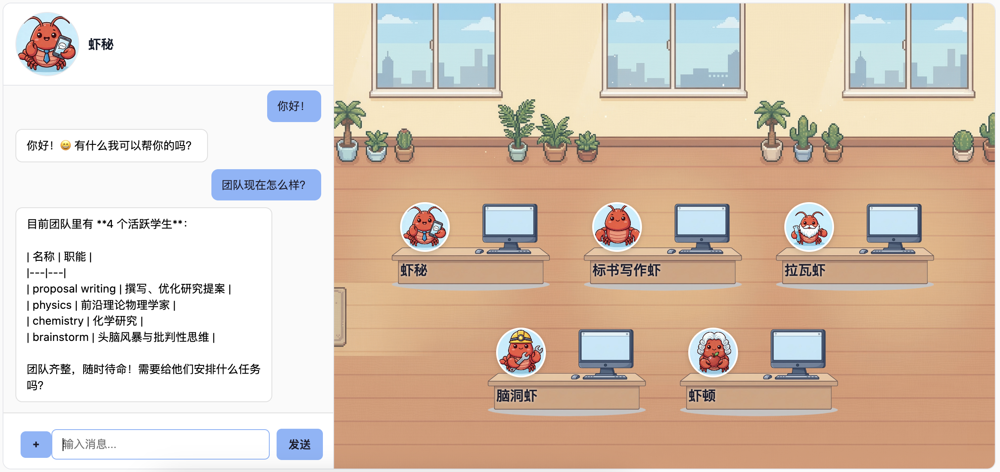

[**中文**](./README_zh.md) | [**English**](./README.md)

# DrClaw

<!-- badges -->
[](https://www.python.org/downloads/)
[](LICENSE)


> A research lab consists of Claws. Your lab, your word.



## Quick Install

Build your lab:

```bash
bash <(curl -fsSL https://raw.githubusercontent.com/qzzqzzb/drclaw/main/install.sh)
```

Update to the latest version:

```bash
bash <(curl -fsSL https://raw.githubusercontent.com/qzzqzzb/drclaw/main/install.sh) update
```

Uninstall the program but keep `~/.drclaw` data:

```bash
bash <(curl -fsSL https://raw.githubusercontent.com/qzzqzzb/drclaw/main/install.sh) uninstall
```

Fully uninstall and delete `~/.drclaw` data too:

```bash
bash <(curl -fsSL https://raw.githubusercontent.com/qzzqzzb/drclaw/main/install.sh) uninstall --purge-data
```

This installs `uv` (if needed), clones the repo to `~/.drclaw-src/`, installs core dependencies, adds macOS tray support when relevant, and symlinks `drclaw` to `~/.local/bin/`.

After installing, [configure your LLM provider](#configuration) to get started.

**Requirements:** Python >= 3.10, git

## Table of Contents

- [Introduction](#introduction)
- [Quick Start](#quick-start)
- [Architecture](#architecture)
- [Features](#features)
- [Configuration](#configuration)
- [Usage](#usage)
- [Roadmap / Todo](#roadmap--todo)
- [Development](#development)
- [Appendix](#appendix)


## Introduction

DrClaw is a lightweight, project-centric multi-agent framework for research workflows. It uses a microkernel architecture with project-level sandbox isolation and hierarchical memory management. The core handles only intent routing, context assembly, and execution — external services connect through standard lightweight interfaces.

## Quick Start

You can basically do anything by asking DrClaw or importing preset templates from Agent Store.

We have a fixed main agent Alice. By default, you can chat with it to:

Hire a new student:

Search papers:

Write a report:

Run experiments:

Data analysis:

Setup a daily reminder: 

We have integrated 200+ scientific skills and 10+ agent templates for out-of-box usage.

### How It Works

Build the lab, then act as a PI. Hire new students, set up goals, wait for results.

## Architecture

```
┌─────────────────────────────────────────────────────────────┐
│                        Frontends                            │
│  ┌──────────┐  ┌──────────┐  ┌──────────┐  ┌────────────┐   │
│  │   CLI    │  │  Web UI  │  │  Feishu  │  │   Tauri    │   │
│  │  (REPL)  │  │ (aiohttp)│  │  (lark)  │  │ (desktop)  │   │
│  └────┬─────┘  └────┬─────┘  └────┬─────┘  └─────┬──────┘   │
└───────┼──────────────┼─────────────┼──────────────┼─────────┘
        │              │             │              │
        ▼              ▼             ▼              ▼
┌─────────────────────────────────────────────────────────────┐
│                      Message Bus                            │
│              (topic-based pub/sub routing)                  │
│                                                             │
│  inbound ──► per-topic queues ──► agents                    │
│  outbound ◄── fan-out to all frontend subscribers           │
└──────┬──────────────┬──────────────────────┬────────────────┘
       │              │                      │
       ▼              ▼                      ▼
┌─────────────┐ ┌─────────────┐    ┌───────────────────┐
│  Assistant  │ │  Student    │    │  Equipment        │
│  (main)     │ │  (proj:id)  │    │  (equip:proto:n)  │
│             │ │             │    │                   │
│ • routing   │ │ • execution │    │ • stateless       │
│ • projects  │ │ • memory    │    │ • max 20 iters    │
│ • equipment │ │ • skills    │    │ • report back     │
│ • env/cron  │ │ • workspace │    │                   │
└──────┬──────┘ └──────┬──────┘    └───────────────────┘
       │               │
       │  route_to     │  use_equipment
       │  ──────────►  │  ──────────────►  Equipment
       │               │
       ▼               ▼
┌─────────────────────────────────────────────────────────────┐
│                     Daemon (Kernel)                         │
│                                                             │
│  ┌──────────────┐  ┌───────────┐  ┌──────────────────────┐  │
│  │ AgentRegistry│  │CronService│  │EquipmentRuntimeMgr   │  │
│  │ (lifecycle)  │  │(scheduler)│  │spawn, monitor, limit │  │
│  └──────────────┘  └───────────┘  └──────────────────────┘  │
└─────────────────────────────────────────────────────────────┘
```

### Workspace Layout

```
~/.drclaw/
├── config.json              # Global configuration
├── projects.json            # Project registry
├── SOUL.md                  # Assistant persona
├── cron/jobs.json           # Scheduled jobs
├── skills/                  # Global skills (user-installed)
├── local-skill-hub/         # Reusable skill templates
├── equipments/              # Equipment prototypes + skills
├── sessions/                # Assistant session history
└── projects/
    └── {project_id}/
        ├── MEMORY.md        # Long-term facts (LLM-rewritten)
        ├── HISTORY.md       # Append-only log
        ├── sessions/        # Student session history
        └── workspace/       # Sandboxed read/write area
            ├── SOUL.md      # Student persona
            └── skills/      # Project-specific skills
```

### Tech Stack

| Layer | Technology |
|-------|-----------|
| Language | Python 3.10+ |
| LLM | litellm (provider-agnostic) |
| CLI | typer + prompt_toolkit + rich |
| State | JSON + Markdown (SQLite deferred) |
| Skills | Markdown-driven SKILL.md, OpenClaw compatible |
| Desktop | Tauri v2 + React 19 |
| Frontends | Web (aiohttp), Feishu (lark-oapi), macOS tray (pystray) |

## Features

### Microkernel Architecture
- Core handles only intent routing, context assembly, and code execution

### Project-Level Sandbox Isolation
- Each project gets its own workspace directory; agents can only write within it
- Independent execution context — bad code in one project cannot affect another

### Hierarchical Memory
- **Global**: project registry and cross-project metadata (maintained by Assistant)
- **Per-project**: `MEMORY.md` (LLM-rewritten long-term facts) + `HISTORY.md` (append-only log)

### Skills System
- 3-tier discovery: workspace > global > builtin
- Always-on skills injected into system prompt; others loaded on-demand
- Local skill hub (`~/.drclaw/local-skill-hub/`) with hierarchical categories for reusable templates
- OpenClaw metadata compatible

### Multi-Agent Concurrency
- Topic-based message bus with per-agent subscriptions
- Agent registry for lifecycle management (spawn, lookup, stop, cleanup)

### Scheduled Automation
- Persistent cron jobs with interval, cron expression, and one-time schedules
- Jobs target `main` or specific student agents

### Frontends
- **Web UI**: aiohttp + WebSocket SPA with session replay
- **Feishu (Lark)**: WebSocket long-connection, no public URL needed
- **Desktop**: Tauri v2 app with sidecar daemon management
- **macOS Tray**: menu-bar app with launchd auto-start
- **More fontend support on the way!**

More [beta features](#Beta) here.

## Configuration

After install, edit `~/.drclaw/config.json` to set your LLM provider. Any [litellm-compatible](https://docs.litellm.ai/docs/providers) model string works.

**OpenRouter:**
```json
{
  "provider": {
    "api_key": "sk-or-v1-...",
    "api_base": "https://openrouter.ai/api/v1",
    "model": "openrouter/anthropic/claude-sonnet-4-5"
  }
}
```

**Anthropic direct:**
```json
{
  "provider": {
    "api_key": "sk-ant-...",
    "model": "anthropic/claude-sonnet-4-5"
  }
}
```

**Web search via Serper:**
```json
{
  "tools": {
    "web": {
      "serper": {
        "api_key": "YOUR_SERPER_API_KEY",
        "endpoint": "https://google.serper.dev/search",
        "max_results": 5
      }
    }
  }
}
```

`web_fetch` does not require an API key.

Note: if you run the above configuration inside Docker, the Web UI will not start by default because of the network restrictions. The Web frontend only accepts loopback binds and loopback peers unless Docker mode is explicitly enabled.

If you knowingly want to run DrClaw locally inside Docker, add:

```json
{
  "daemon": {
    "web_in_docker": true
  }
}
```

With this enabled, the Web frontend binds to `0.0.0.0` and relaxes the peer-address check for Docker bridge traffic; `Host` and `Origin` still must be `127.0.0.1`, `::1`, or `localhost`. This is intended for local-only Docker publishing such as:

```bash
docker run -p 127.0.0.1:8080:8080 ...
```

Note: this switch only affects the Web UI. External-agent callbacks still assume same-host `127.0.0.1` reachability.

## Beta

We have a list of beta features. These features integrated in the main version, but not fully tested. If you want to use them, be careful. 

### Docker Sandbox Jobs

Student agents can now use `create_job` to start a Docker-backed sandbox job for high-risk shell work.

- Exposed to student / project agents only; the main assistant does not call this tool directly
- Current implementation is `shell_task` only: the host-side manager launches a Docker container to run the command
- Default mode is async: with `await_result=false`, the tool returns immediately with `job_id` / `request_id` while the job keeps running in the background
- Use `get_job_status` / `list_active_jobs` to inspect progress, and `pause_job` / `resume_job` / `cancel_job` to control a live job
- Containers exit and are cleaned up after completion; persisted state lives in the job record, workspace, and artifacts, not in a long-lived container
- Still beta: approval flow, in-container agent workers, and stricter network / permission controls are planned next

### External Agent Protocol

External Agent Protocol let you connect any external agent to DrClaw, and interact with them via web.

Configure external agents in `~/.drclaw/config.json`:

```json
{
  "external_agents": [
    {
      "id": "chem",
      "label": "Chem External",
      "request_url": "http://127.0.0.1:9010/request",
      "description": "External chemistry specialist",
      "avatar": "/assets/avatars/1.png",
      "request_timeout_seconds": 10,
      "callback_timeout_seconds": 120
    }
  ]
}
```

When a user (or internal agent tool) sends to `ext:chem`, DrClaw sends:

```json
{
  "protocol": "drclaw-external-agent-v1",
  "request_id": "f9d9...",
  "agent_id": "ext:chem",
  "text": "User message text",
  "metadata": {
    "webui_language": "en"
  },
  "callback": {
    "url": "http://127.0.0.1:8080/api/external/callback",
    "method": "POST"
  }
}
```

Provider must reply asynchronously by calling DrClaw callback URL with:

```json
{
  "request_id": "f9d9...",
  "agent_id": "ext:chem",
  "text": "Provider response text",
  "metadata": {
    "provider_trace_id": "abc123"
  }
}
```

Or failure:

```json
{
  "request_id": "f9d9...",
  "agent_id": "ext:chem",
  "error": "Provider timeout"
}
```

Notes:
- v1 is text-only (`files` are not supported for external agents).
- v1 assumes callback reachability on same host (`127.0.0.1`).
- v1 callback auth is intentionally omitted for prototype use in trusted environments.

## Usage

```bash
# Interactive chat
drclaw chat

# Chat with a specific project
drclaw chat --project <name-or-id>

# Single-message mode
drclaw chat -m "List my projects"

# Project management
drclaw projects list
drclaw projects create "My Research"
drclaw status

# Daemon mode
drclaw daemon -f web
drclaw daemon -f feishu

# macOS tray
drclaw tray

# Cron
drclaw cron list
drclaw cron add --message "Daily summary" --cron "0 8 * * *" --tz "Asia/Shanghai"

# Reset
drclaw reset --yes               # full reset (keeps config)
drclaw reset --yes --memory-only  # reset memory only
```

## Roadmap / Todo

- [x] v0.1.0 Release 
- [ ] More LLM providers
- [ ] Better sandboxing
- [ ] Content safety filter
- [ ] Agent group chat
- [ ] Launch a **Agent Marketplace (Web Hub)** for streamlined browsing, downloading, and publishing of agent templates. For now, you can upload your templates via PRs.
- [ ] Agent lifespan

## Development

```bash
# Run tests
uv run pytest tests/ -v

# Lint and format
uv run ruff check drclaw/
uv run ruff format drclaw/

# Type check
uv run mypy .
```

## Appendix

<details>
<summary>Tray + launchd (macOS)</summary>

- `drclaw launchd install` creates `~/Library/LaunchAgents/com.drclaw.tray.plist`
- Default: manual-start (`RunAtLoad=false`, `KeepAlive=false`)
- Tray menu: "Control Panel" (opens browser) and "Exit" (SIGINT to daemon)

Tray config in `~/.drclaw/config.json`:
```json
{
  "tray": {
    "control_panel_url": "http://127.0.0.1:8080",
    "daemon_program": ["uv","run","drclaw","daemon","-f","web"],
    "daemon_env": {},
    "shutdown_timeout_seconds": 8
  }
}
```

```bash
drclaw launchd install
drclaw launchd start
drclaw launchd status
drclaw launchd stop
drclaw launchd uninstall
```
</details>

<details>
<summary>Feishu (Lark) setup</summary>

1. Create a Feishu app at https://open.feishu.cn/app, enable **Bot**
2. Add permissions: `im:message` (send), `im:message.p2p_msg:readonly` (receive)
3. Add event `im.message.receive_v1`, choose **Long Connection** mode
4. Configure `~/.drclaw/config.json`:

```json
{
  "feishu": {
    "app_id": "cli_xxx",
    "app_secret": "xxx",
    "encrypt_key": "",
    "verification_token": "",
    "allow_from": [],
    "reconnect_interval_seconds": 5
  }
}
```

5. `drclaw daemon -f feishu`
6. Publish app and send a message to the bot

**Troubleshooting:**
- No messages: check event subscription is in Long Connection mode
- Startup fails: verify `app_id`/`app_secret`
- Network issues: add Feishu domains to `NO_PROXY` (`open.feishu.cn,*.feishu.cn,*.larksuite.com`)
</details>

<details>
<summary>Daemon agent activation</summary>

- New projects activate immediately when created via the Assistant
- Activation state persisted at `~/.drclaw/runtime/project-activation.json`
- Daemon boot starts `main` + previously activated projects
- Web API: `GET /api/agents`, `POST /api/agents/{id}/activate`, `GET /api/agents/{id}/history`
</details>

<details>
<summary>Equipment await policy</summary>

- `await_result=true` (sync): student waits for completion in the same tool call
- `await_result=false` (async): returns immediately, completion delivered via callback
- For async mode, track progress via `list_active_equipment_runs` / `get_equipment_run_status`
</details>

<details>
<summary>Source-aware inference mapping</summary>

- Session history normalized to provider-safe payloads before LLM inference
- Cross-agent user turns get `name` set to `source` with content header fallback
- External human sources (e.g. Feishu) treated as plain user input
</details>
